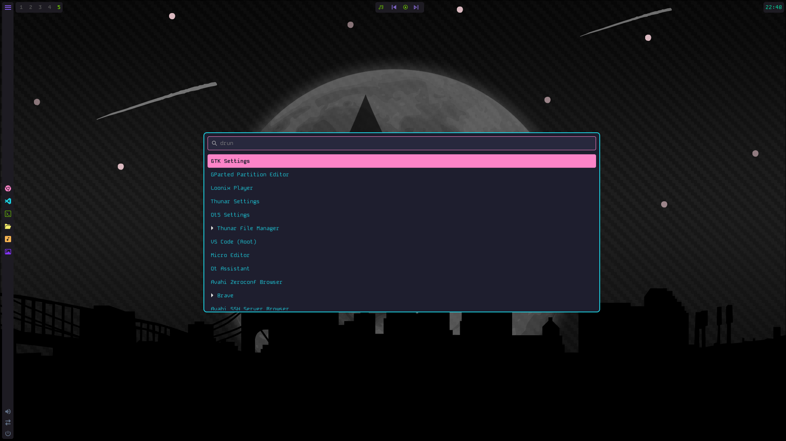

# Loonix-Wofi (Loonix-Vibe Theme)

Aura-inspired Wofi configuration for the Loonix desktop environment. Designed to match the neon aesthetics.

  

## Features

- **Theme Name**: Loonix-Vibe
- **Colors**: Cyan (#1ccfdf) & Pink (#fd84c8)
- **Visuals**: Glassmorphism with Hyprland Layer Blur
- **Font**: Kode Mono

## Integration

This repo is intended to be symlinked into the `loonix` main playground:
`~/loonix-wofi` -> `~/loonix/.config/wofi` -> `~/.config/wofi`
